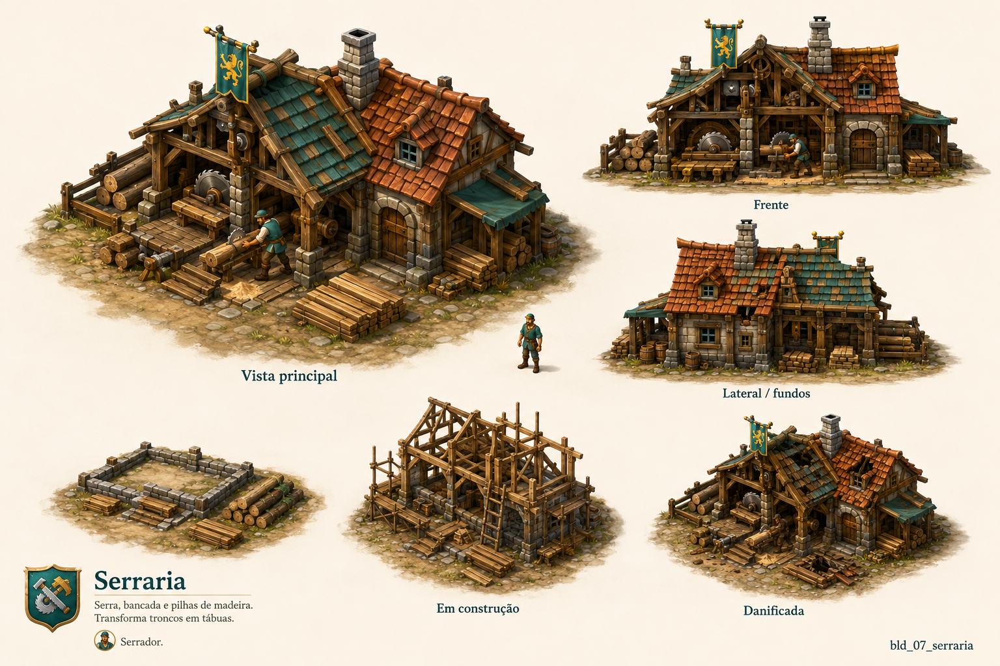

# Serraria

Identificador: `bld_07_serraria` · Categoria: Construções

Prancha conceitual gerada com a ferramenta nativa de imagens. Não é um modelo 3D, sprite recortado ou animação pronta para a engine.

## Função e referência

Serra, bancada e pilhas de madeira. Transforma troncos em tábuas.

## Arquivos

- [Imagem PNG](../construcoes/07-serraria.png)
- [Prompt efetivamente utilizado](../prompts/bld_07_serraria.txt)

## Uso na produção

Usar a vista principal como referência dominante de aparência. Conferir volumes entre vistas antes de modelar. Definir escala no terreno, colisão, entrada, entrega e pontos de trabalho. Separar mecanismos, andaimes e elementos que mudam de estado. Os construtores e serventes atendem a obra automaticamente; o profissional indicado opera o prédio depois de concluído.

## Revisão visual

Identidade correta, vista principal legível, vistas de apoio e três estados presentes. Estilo medieval coerente com a referência. Fundação desenhada sem legenda. Acionamento da serra deve ser detalhado na modelagem.

## Limites

Prancha raster de conceito. Vistas precisam ser reconciliadas na modelagem; não contém modelo 3D, transparência, rig ou animação executável.
