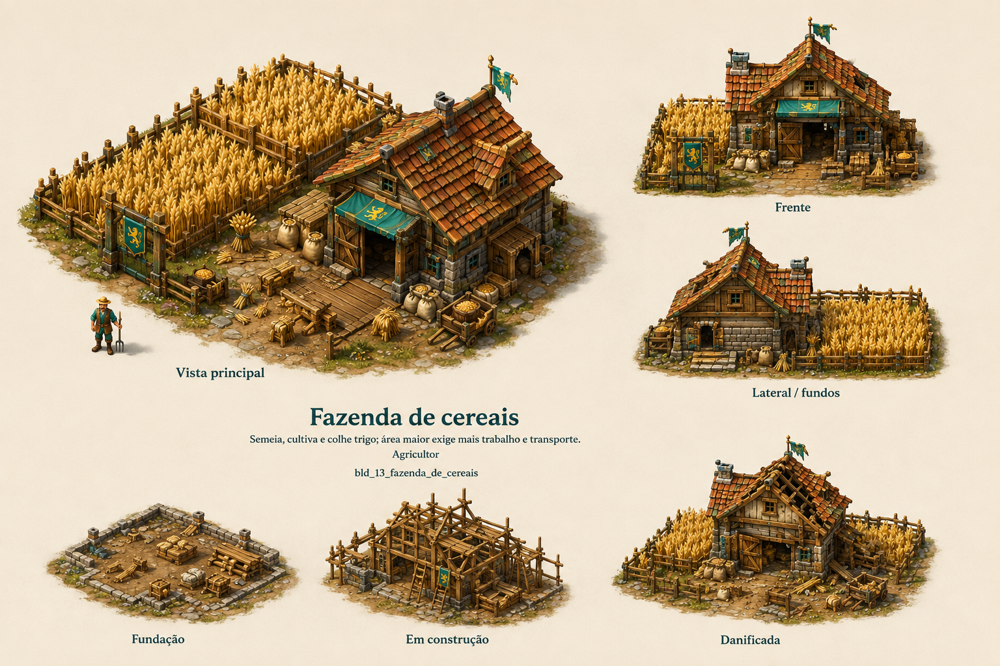

# Fazenda de cereais

Identificador: `bld_13_fazenda_de_cereais` · Categoria: Construções

Prancha conceitual gerada com a ferramenta nativa de imagens. Não é um modelo 3D, sprite recortado ou animação pronta para a engine.

## Função e referência

Celeiro e campos anexos. Semeia, cultiva e colhe trigo; área maior exige mais trabalho e transporte.

## Arquivos

- [Imagem PNG](../construcoes/13-fazenda_de_cereais.png)
- [Prompt efetivamente utilizado](../prompts/bld_13_fazenda_de_cereais-used.txt)

## Uso na produção

Usar a vista principal como referência dominante de aparência. Conferir volumes entre vistas antes de modelar. Definir escala no terreno, colisão, entrada, entrega e pontos de trabalho. Separar mecanismos, andaimes e elementos que mudam de estado. Os construtores e serventes atendem a obra automaticamente; o profissional indicado opera o prédio depois de concluído.

## Revisão visual

Identidade correta, vista principal legível, vistas de apoio e três estados presentes. Estilo medieval coerente com a referência. Segunda geração corrigiu inclusão indevida de moinho, removido para manter a identidade da fazenda.

## Limites

Prancha raster de conceito. Vistas precisam ser reconciliadas na modelagem; não contém modelo 3D, transparência, rig ou animação executável.
