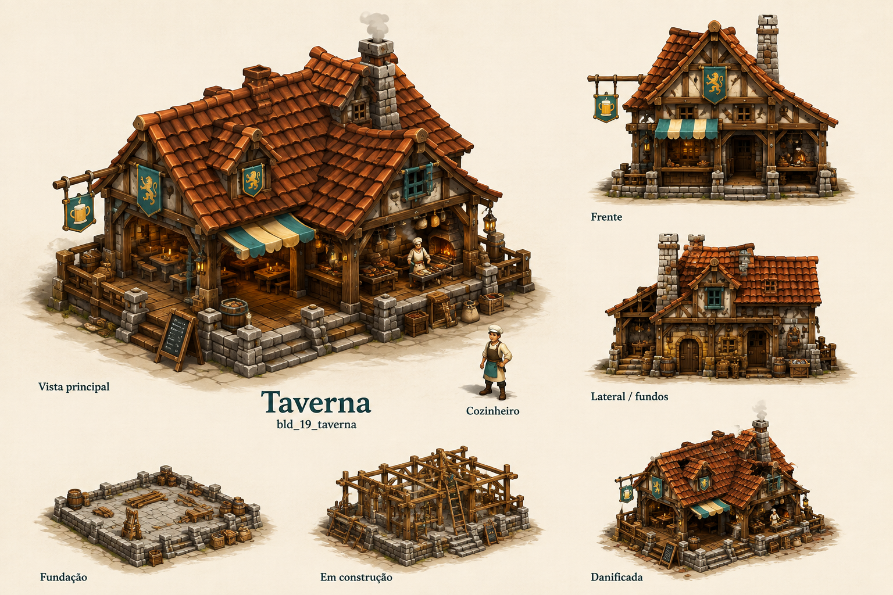

# Taverna

Identificador: `bld_19_taverna` · Categoria: Construções

Prancha conceitual gerada com a ferramenta nativa de imagens. Não é um modelo 3D, sprite recortado ou animação pronta para a engine.

## Função e referência

Salão com mesas e cozinha visível. Serve alimentos e prepara peixe e carne; produz rações transportáveis para viagens e guerra. Recebe vinho da vinícola para servir como bebida.

## Arquivos

- [Imagem PNG](../construcoes/19-taverna.png)
- [Prompt efetivamente utilizado](../prompts/bld_19_taverna.txt)

## Uso na produção

Usar a vista principal como referência dominante de aparência. Conferir volumes entre vistas antes de modelar. Definir escala no terreno, colisão, entrada, entrega e pontos de trabalho. Separar mecanismos, andaimes e elementos que mudam de estado. Os construtores e serventes atendem a obra automaticamente; o profissional indicado opera o prédio depois de concluído.

## Revisão visual

Revisão em andamento.

## Limites

['Referência raster; ainda não é modelo 3D nem atlas de animação.', 'Conciliar diferenças menores entre vistas durante modelagem; remover ID técnico da arte final.']
