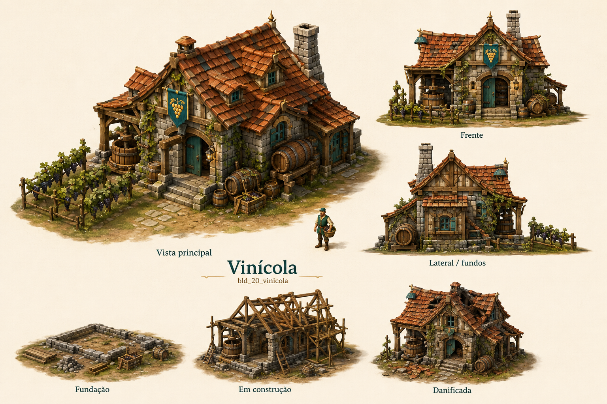

# Vinícola

Identificador: `bld_20_vinicola` · Categoria: Construções

Prancha conceitual gerada com a ferramenta nativa de imagens. Não é um modelo 3D, sprite recortado ou animação pronta para a engine.

## Função e referência

Casa de pedra com prensa, adega e barris, ligada a parreirais desenhados no terreno. O vinhateiro cultiva e colhe uvas, depois as transforma em vinho. Serventes retiram a produção e abastecem a taverna, o armazém ou o mercado.

## Arquivos

- [Imagem PNG](../construcoes/20-vinicola.png)
- [Prompt efetivamente utilizado](../prompts/bld_20_vinicola.txt)

## Uso na produção

Usar a vista principal como referência dominante de aparência. Conferir volumes entre vistas antes de modelar. Definir escala no terreno, colisão, entrada, entrega e pontos de trabalho. Separar mecanismos, andaimes e elementos que mudam de estado. Os construtores e serventes atendem a obra automaticamente; o profissional indicado opera o prédio depois de concluído.

## Revisão visual

Revisão em andamento.

## Limites

['Referência raster; ainda não é modelo 3D nem atlas de animação.', 'Conciliar diferenças menores entre vistas durante modelagem; remover ID técnico da arte final.']
