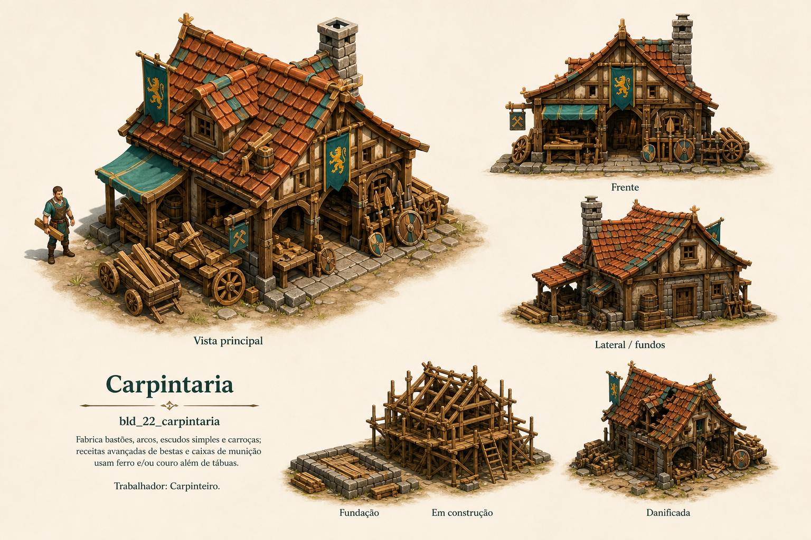

# Carpintaria

Identificador: `bld_22_carpintaria` · Categoria: Construções

Prancha conceitual gerada com a ferramenta nativa de imagens. Não é um modelo 3D, sprite recortado ou animação pronta para a engine.

## Função e referência

Bancadas, rodas e armas de madeira. Fabrica bastões, arcos, escudos simples e carroças; receitas avançadas de bestas e caixas de munição usam ferro e/ou couro além de tábuas.

## Arquivos

- [Imagem PNG](../construcoes/22-carpintaria.png)
- [Prompt efetivamente utilizado](../prompts/bld_22_carpintaria.txt)

## Uso na produção

Usar a vista principal como referência dominante de aparência. Conferir volumes entre vistas antes de modelar. Definir escala no terreno, colisão, entrada, entrega e pontos de trabalho. Separar mecanismos, andaimes e elementos que mudam de estado. Os construtores e serventes atendem a obra automaticamente; o profissional indicado opera o prédio depois de concluído.

## Revisão visual

Revisão em andamento.

## Limites

['Referência raster; ainda não é modelo 3D nem atlas de animação.', 'Conciliar detalhes menores entre vistas durante modelagem; texto extra e ID não pertencem ao asset do jogo.', 'As miniaturas de fundação e em construção ficaram contíguas; separar em assets ao modelar.']
