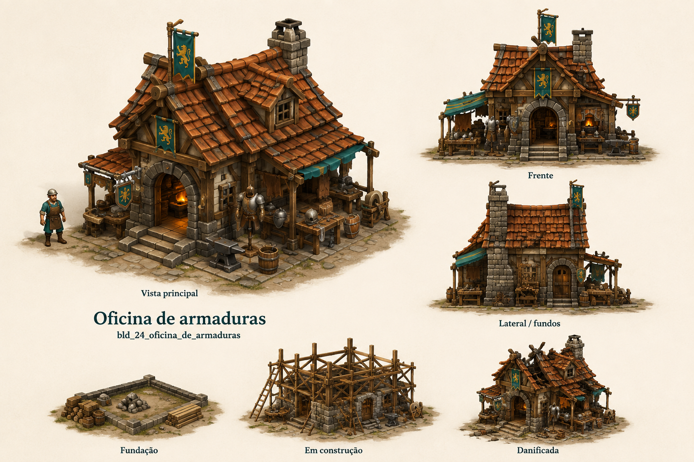

# Oficina de armaduras

Identificador: `bld_24_oficina_de_armaduras` · Categoria: Construções

Prancha conceitual gerada com a ferramenta nativa de imagens. Não é um modelo 3D, sprite recortado ou animação pronta para a engine.

## Função e referência

Bancadas e suportes com equipamentos. Produz proteção leve com couro e proteção pesada com ferro, carvão e couro.

## Arquivos

- [Imagem PNG](../construcoes/24-oficina_de_armaduras.png)
- [Prompt efetivamente utilizado](../prompts/bld_24_oficina_de_armaduras.txt)

## Uso na produção

Usar a vista principal como referência dominante de aparência. Conferir volumes entre vistas antes de modelar. Definir escala no terreno, colisão, entrada, entrega e pontos de trabalho. Separar mecanismos, andaimes e elementos que mudam de estado. Os construtores e serventes atendem a obra automaticamente; o profissional indicado opera o prédio depois de concluído.

## Revisão visual

Revisão em andamento.

## Limites

['Referência raster; ainda não é modelo 3D nem atlas de animação.', 'Conciliar detalhes menores entre vistas durante modelagem; ID técnico não pertence ao asset do jogo.']
