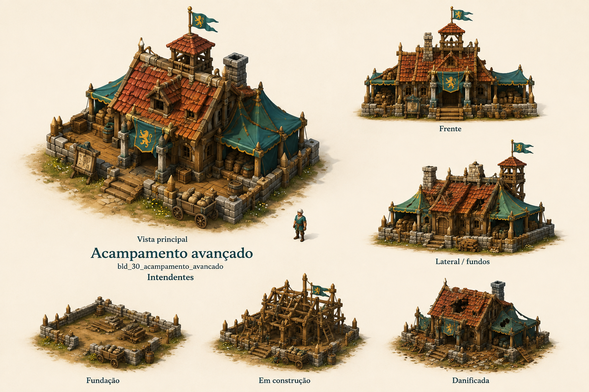

# Acampamento avançado

Identificador: `bld_30_acampamento_avancado` · Categoria: Construções

Prancha conceitual gerada com a ferramenta nativa de imagens. Não é um modelo 3D, sprite recortado ou animação pronta para a engine.

## Função e referência

Tendas e depósito protegido fora da vila. Recebe rações, munição e equipamentos; oferece descanso e reabastecimento próximos ao objetivo. Não produz recursos.

## Arquivos

- [Imagem PNG](../construcoes/30-acampamento_avancado.png)
- [Prompt efetivamente utilizado](../prompts/bld_30_acampamento_avancado.txt)

## Uso na produção

Usar a vista principal como referência dominante de aparência. Conferir volumes entre vistas antes de modelar. Definir escala no terreno, colisão, entrada, entrega e pontos de trabalho. Separar mecanismos, andaimes e elementos que mudam de estado. Os construtores e serventes atendem a obra automaticamente; o profissional indicado opera o prédio depois de concluído.

## Revisão visual

Revisão em andamento.

## Limites

['Referência raster; ainda não é modelo 3D nem atlas de animação.', 'Conciliar detalhes menores entre vistas durante modelagem; retirar textos da peça final.', 'O depósito foi representado como construção sólida entre tendas; dimensões e custo devem refletir essa permanência.']
