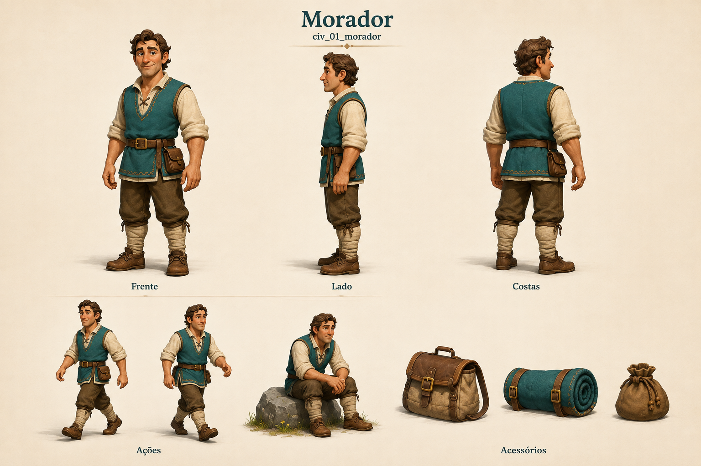

# Morador

Identificador: `civ_01_morador` · Categoria: Vida na vila

Prancha conceitual gerada com a ferramenta nativa de imagens. Não é um modelo 3D, sprite recortado ou animação pronta para a engine.

## Função e referência

Habitante disponível para formação ou recrutamento. Roupa simples, bolsa de viagem e poses de espera, caminhada e descanso.

## Arquivos

- [Imagem PNG](../civis/01-morador.png)
- [Prompt efetivamente utilizado](../prompts/civ_01_morador.txt)

## Uso na produção

Usar as vistas como referência de roupa, proporção e acessórios. Definir uma malha e esqueleto coerentes antes de animar. Ferramentas e cargas precisam de objetos e pontos de fixação próprios. As poses de ação são referências; não são quadros consecutivos de uma animação.

O personagem recebe tarefas automaticamente conforme sua profissão. O jogador solicita formação no centro de treinamento e não escolhe seu destino individual.

## Revisão visual

Revisão em andamento.

## Limites

Referência conceitual raster; não é malha 3D, rig ou atlas de animação. Identificador adicional aparece sob título.
