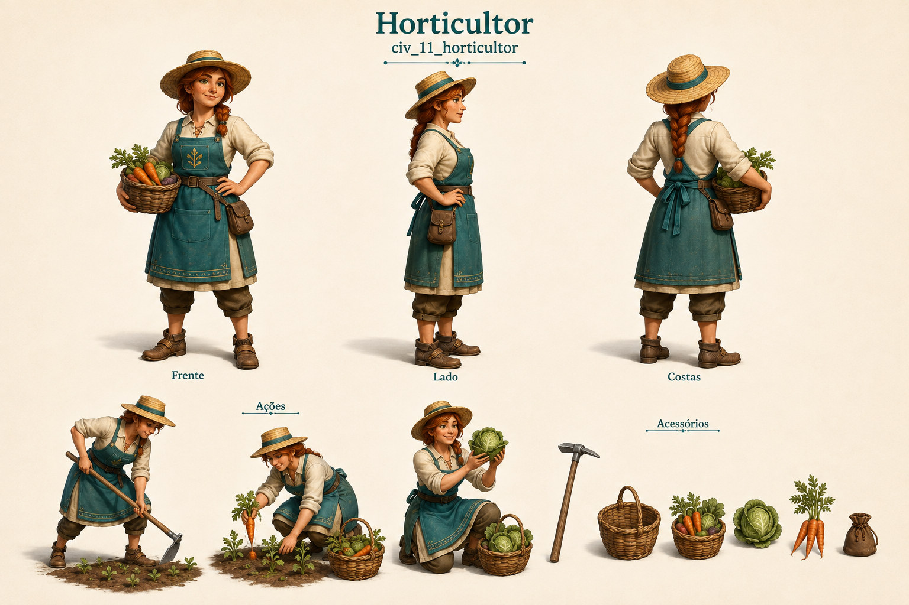

# Horticultor

Identificador: `civ_11_horticultor` · Categoria: Vida na vila

Prancha conceitual gerada com a ferramenta nativa de imagens. Não é um modelo 3D, sprite recortado ou animação pronta para a engine.

## Função e referência

Prepara canteiros e colhe legumes para a alimentação da vila.

## Arquivos

- [Imagem PNG](../civis/11-horticultor.png)
- [Prompt efetivamente utilizado](../prompts/civ_11_horticultor-used.txt)

## Uso na produção

Usar as vistas como referência de roupa, proporção e acessórios. Definir uma malha e esqueleto coerentes antes de animar. Ferramentas e cargas precisam de objetos e pontos de fixação próprios. As poses de ação são referências; não são quadros consecutivos de uma animação.

O personagem recebe tarefas automaticamente conforme sua profissão. O jogador solicita formação no centro de treinamento e não escolhe seu destino individual.

## Revisão visual

Revisão em andamento.

## Limites

Prancha conceitual raster, sem malha 3D, rig ou frames finais. Ferramentas nas poses e na fileira podem ter pequenas variações de formato; padronizar na modelagem.
