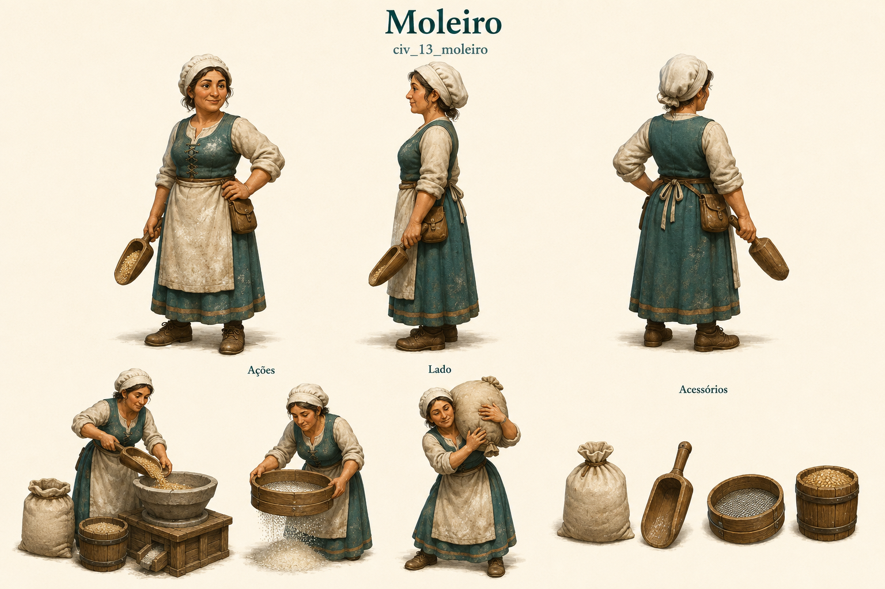

# Moleiro

Identificador: `civ_13_moleiro` · Categoria: Vida na vila

Prancha conceitual gerada com a ferramenta nativa de imagens. Não é um modelo 3D, sprite recortado ou animação pronta para a engine.

## Função e referência

Recebe trigo e opera o moinho para produzir farinha.

## Arquivos

- [Imagem PNG](../civis/13-moleiro.png)
- [Prompt efetivamente utilizado](../prompts/civ_13_moleiro-used.txt)

## Uso na produção

Usar as vistas como referência de roupa, proporção e acessórios. Definir uma malha e esqueleto coerentes antes de animar. Ferramentas e cargas precisam de objetos e pontos de fixação próprios. As poses de ação são referências; não são quadros consecutivos de uma animação.

O personagem recebe tarefas automaticamente conforme sua profissão. O jogador solicita formação no centro de treinamento e não escolhe seu destino individual.

## Revisão visual

Revisão em andamento.

## Limites

Prancha conceitual raster, sem malha 3D, rig ou frames finais. Legendas Frente/Costas ausentes e Lado deslocada; orientação visual permanece inequívoca.
