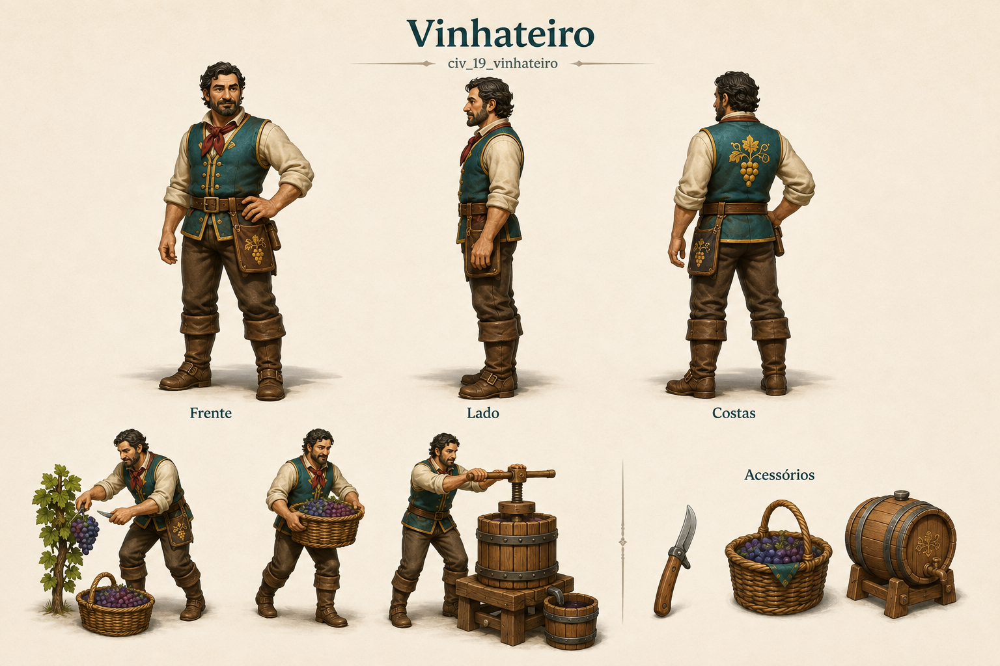

# Vinhateiro

Identificador: `civ_19_vinhateiro` · Categoria: Vida na vila

Prancha conceitual gerada com a ferramenta nativa de imagens. Não é um modelo 3D, sprite recortado ou animação pronta para a engine.

## Função e referência

Cultiva e colhe uvas, opera a prensa e produz vinho na vinícola.

## Arquivos

- [Imagem PNG](../civis/19-vinhateiro.png)
- [Prompt efetivamente utilizado](../prompts/civ_19_vinhateiro-used.txt)

## Uso na produção

Usar as vistas como referência de roupa, proporção e acessórios. Definir uma malha e esqueleto coerentes antes de animar. Ferramentas e cargas precisam de objetos e pontos de fixação próprios. As poses de ação são referências; não são quadros consecutivos de uma animação.

O personagem recebe tarefas automaticamente conforme sua profissão. O jogador solicita formação no centro de treinamento e não escolhe seu destino individual.

## Revisão visual

Revisão em andamento.

## Limites

Prancha conceitual raster, sem malha 3D, rig ou frames finais. Pequenas variações de adereços e desenhos de roupas devem ser padronizadas ao modelar.
