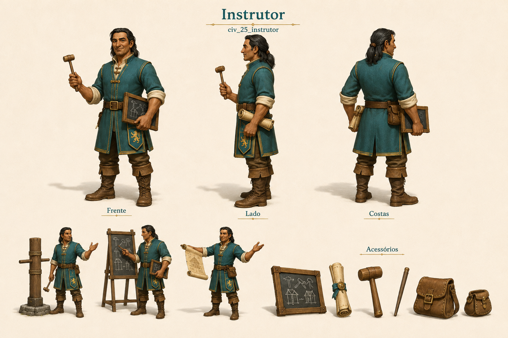

# Instrutor

Identificador: `civ_25_instrutor` · Categoria: Vida na vila

Prancha conceitual gerada com a ferramenta nativa de imagens. Não é um modelo 3D, sprite recortado ou animação pronta para a engine.

## Função e referência

Ensina profissões no centro de treinamento. Os novos profissionais formados encontram trabalho automaticamente.

## Arquivos

- [Imagem PNG](../civis/25-instrutor.png)
- [Prompt efetivamente utilizado](../prompts/civ_25_instrutor-used.txt)

## Uso na produção

Usar as vistas como referência de roupa, proporção e acessórios. Definir uma malha e esqueleto coerentes antes de animar. Ferramentas e cargas precisam de objetos e pontos de fixação próprios. As poses de ação são referências; não são quadros consecutivos de uma animação.

O personagem recebe tarefas automaticamente conforme sua profissão. O jogador solicita formação no centro de treinamento e não escolhe seu destino individual.

## Revisão visual

Instrutor civil reconhecível com quadro de ofícios, malho e pergaminho. Três vistas completas, três poses de ensino e acessórios separados presentes. Roupa, rosto e cabelo coerentes; a vista lateral usa pergaminho em vez do quadro, uma variação de acessório removível.

## Limites

Prancha raster de conceito. Vistas precisam ser reconciliadas na modelagem; não contém modelo 3D, transparência, rig ou animação executável.
