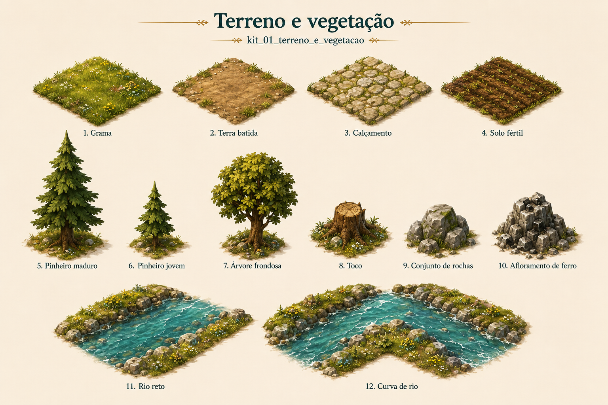

# Terreno e vegetação

Identificador: `kit_01_terreno_e_vegetacao` · Categoria: Mundo e objetos

Prancha conceitual gerada com a ferramenta nativa de imagens. Não é um modelo 3D, sprite recortado ou animação pronta para a engine.

## Função e referência

Grama, terra, calçamento, solo fértil, árvores maduras e jovens, toco, rochas, minério e trechos de rio.

## Arquivos

- [Imagem PNG](../kits/01-terreno_e_vegetacao.png)
- [Prompt efetivamente utilizado](../prompts/kit_01_terreno_e_vegetacao.txt)

## Uso na produção

Modelar ou preparar cada componente separadamente. A disposição na prancha organiza referências e não define coordenadas de um atlas de sprites. Padronizar escala, encaixes, pontos de origem e materiais na etapa técnica.

## Revisão visual

Prancha conferida: componentes solicitados presentes, separados e reconhecíveis, com paleta e perspectiva coerentes.

## Limites

Referência raster com fundo. Escala entre famílias, encaixes e mecanismos devem ser definidos em modelagem; não é atlas recortado nem animação.
