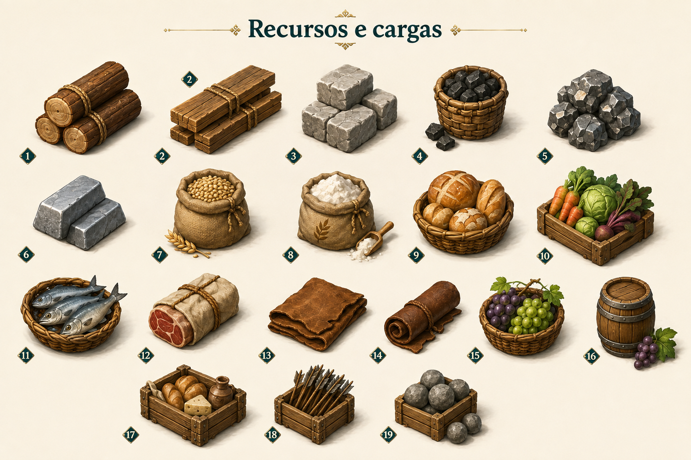

# Recursos e cargas

Identificador: `kit_05_recursos_e_cargas` · Categoria: Mundo e objetos

Prancha conceitual gerada com a ferramenta nativa de imagens. Não é um modelo 3D, sprite recortado ou animação pronta para a engine.

## Função e referência

1 troncos; 2 tábuas; 3 pedra; 4 carvão; 5 minério; 6 ferro; 7 trigo; 8 farinha; 9 pão; 10 legumes; 11 peixe; 12 carne; 13 peles; 14 couro; 15 uvas; 16 vinho; 17 rações; 18 munição; 19 pedras de catapulta. Itens desenhados dentro de rações ilustram a carga e não acrescentam novas cadeias produtivas às regras.

## Arquivos

- [Imagem PNG](../kits/05-recursos_e_cargas.png)
- [Prompt efetivamente utilizado](../prompts/kit_05_recursos_e_cargas.txt)

## Uso na produção

Modelar ou preparar cada componente separadamente. A disposição na prancha organiza referências e não define coordenadas de um atlas de sprites. Padronizar escala, encaixes, pontos de origem e materiais na etapa técnica.

## Revisão visual

Prancha conferida: componentes solicitados presentes, separados e reconhecíveis, com paleta e perspectiva coerentes. A numeração 2 aparece duas vezes; a sequência de recursos no prompt e na ficha é a referência de identificação.

## Limites

Referência raster com fundo. Escala entre famílias, encaixes e mecanismos devem ser definidos em modelagem; não é atlas recortado nem animação.
