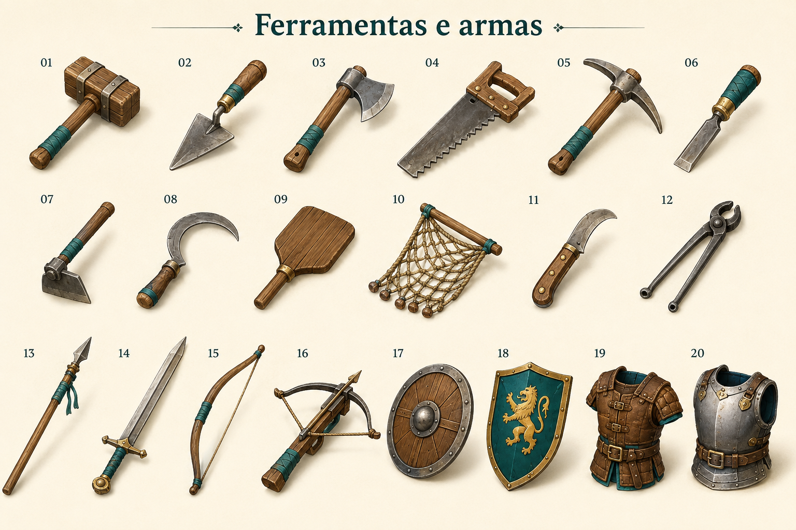

# Ferramentas e armas

Identificador: `kit_06_ferramentas_e_armas` · Categoria: Mundo e objetos

Prancha conceitual gerada com a ferramenta nativa de imagens. Não é um modelo 3D, sprite recortado ou animação pronta para a engine.

## Função e referência

1 malho; 2 colher de pedreiro; 3 machado; 4 serra; 5 picareta; 6 cinzel; 7 enxada; 8 foice; 9 pá de forno; 10 rede; 11 faca de poda; 12 tenazes; 13 lança; 14 espada; 15 arco; 16 besta; 17 escudo de madeira; 18 escudo de facção; 19 proteção leve; 20 peitoral de ferro.

## Arquivos

- [Imagem PNG](../kits/06-ferramentas_e_armas.png)
- [Prompt efetivamente utilizado](../prompts/kit_06_ferramentas_e_armas.txt)

## Uso na produção

Modelar ou preparar cada componente separadamente. A disposição na prancha organiza referências e não define coordenadas de um atlas de sprites. Padronizar escala, encaixes, pontos de origem e materiais na etapa técnica.

## Revisão visual

Prancha conferida: componentes solicitados presentes, separados e reconhecíveis, com paleta e perspectiva coerentes.

## Limites

Referência raster com fundo. Escala entre famílias, encaixes e mecanismos devem ser definidos em modelagem; não é atlas recortado nem animação.
