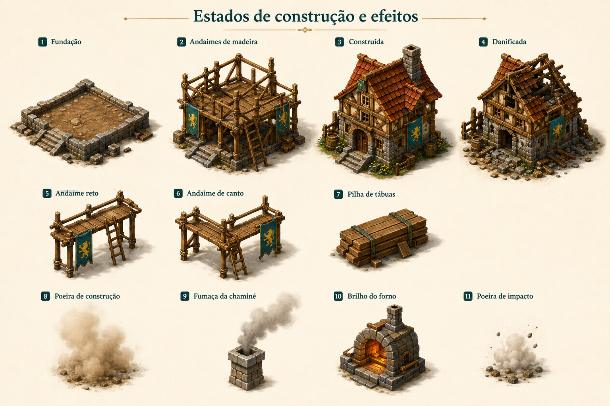

# Estados de construção e efeitos

Identificador: `kit_08_estados_de_construcao_e_efeitos` · Categoria: Mundo e objetos

Prancha conceitual gerada com a ferramenta nativa de imagens. Não é um modelo 3D, sprite recortado ou animação pronta para a engine.

## Função e referência

Casa em fundação, construção, concluída e danificada; andaimes, tábuas e referências de poeira, fumaça, forno e impacto.

## Arquivos

- [Imagem PNG](../kits/08-estados_de_construcao_e_efeitos.png)
- [Prompt efetivamente utilizado](../prompts/kit_08_estados_de_construcao_e_efeitos.txt)

## Uso na produção

Modelar ou preparar cada componente separadamente. A disposição na prancha organiza referências e não define coordenadas de um atlas de sprites. Padronizar escala, encaixes, pontos de origem e materiais na etapa técnica.

## Revisão visual

Prancha conferida: componentes solicitados presentes, separados e reconhecíveis, com paleta e perspectiva coerentes.

## Limites

Referência raster com fundo. Escala entre famílias, encaixes e mecanismos devem ser definidos em modelagem; não é atlas recortado nem animação.
