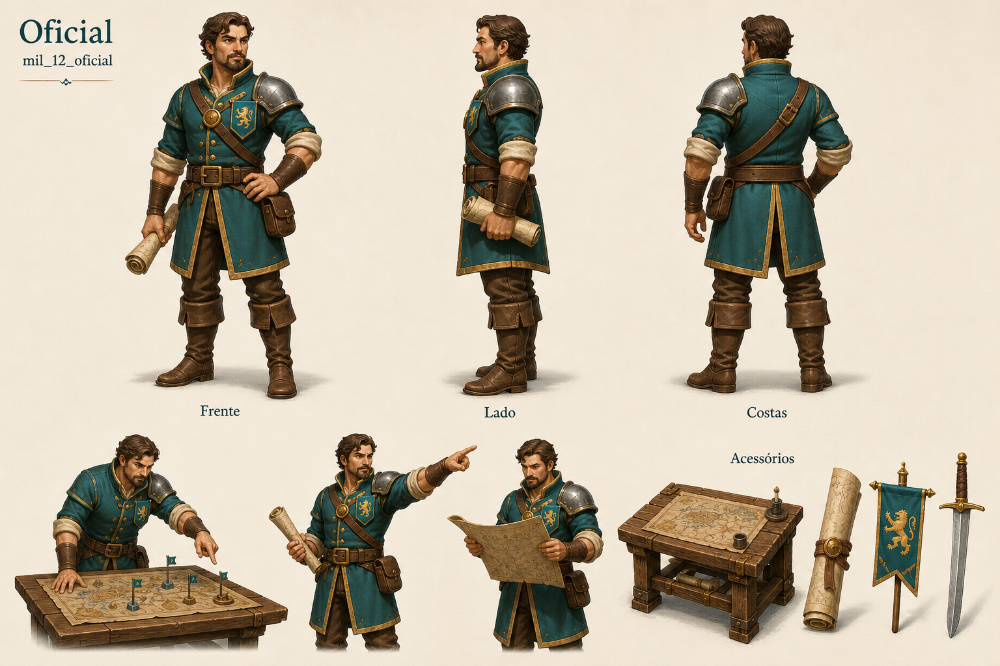

# Oficial

Identificador: `mil_12_oficial` · Categoria: Exército

Prancha conceitual gerada com a ferramenta nativa de imagens. Não é um modelo 3D, sprite recortado ou animação pronta para a engine.

## Função e referência

Coordena operações no posto de comando, usando mapas e relatórios. Função de organização militar.

## Arquivos

- [Imagem PNG](../militares/12-oficial.png)
- [Prompt efetivamente utilizado](../prompts/mil_12_oficial.txt)

## Uso na produção

Usar as vistas como referência de roupa, proporção e acessórios. Definir uma malha e esqueleto coerentes antes de animar. Ferramentas e cargas precisam de objetos e pontos de fixação próprios. As poses de ação são referências; não são quadros consecutivos de uma animação.

## Revisão visual

Identidade, vistas de frente/lado/costas, ações e acessórios conferidos visualmente. Paleta e proporções coerentes com o conjunto.

## Limites

Prancha de referência; poses não formam animação. Pequenas diferenças de pose e equipamento entre vistas precisam de unificação na modelagem.
